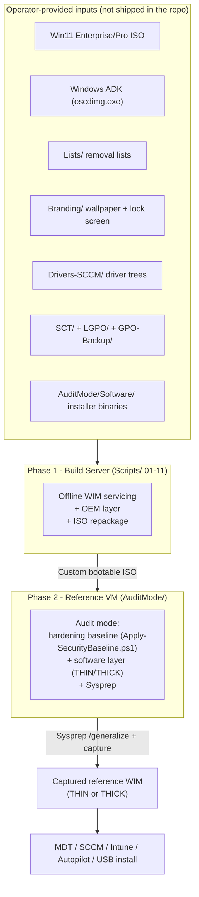
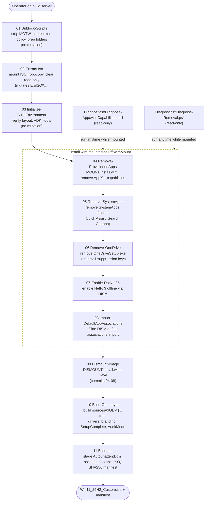
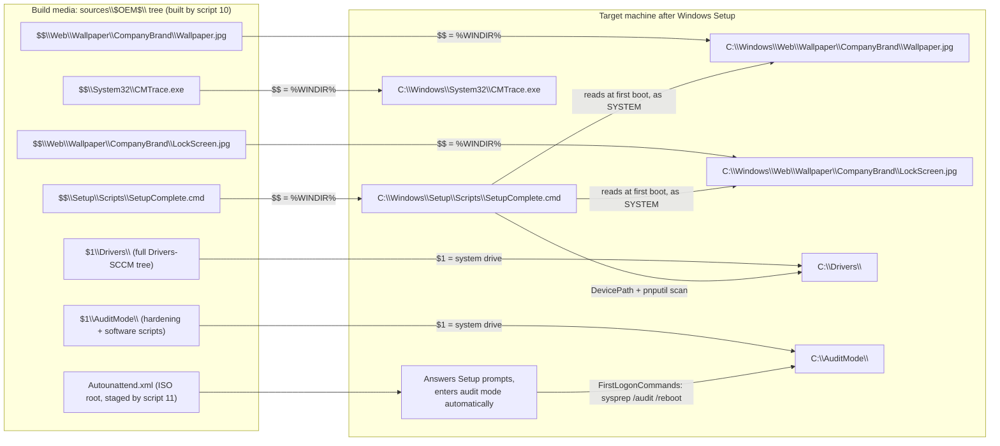
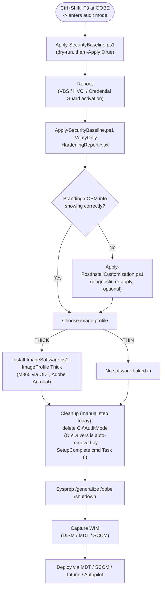

# Architecture

This document describes how Modern Windows Image Factory is put together: the two build
phases, the pipeline that runs on each, and how files move from the repo into the final
deployed machine. For "what to run and in what order," see `Scripts/README.md` and
`AuditMode/README.md` — this document is the map of *why* it's structured this way.

The diagrams below are also kept as standalone Mermaid source files in
[`docs/diagrams/`](docs/diagrams) so they can be rendered outside GitHub (mermaid CLI,
mermaid.live, Confluence, etc.) without copy-pasting out of this file.

## 1. Two-phase system

The build is split across two machines that never need to be the same box:

- **Build server** (`Scripts/01-11`) — offline DISM servicing of `install.wim` plus an
  ISO repackage. No VM required, nothing here boots Windows.
- **Reference VM** (`AuditMode/`) — boots the custom ISO into audit mode, applies the
  security baseline (`Apply-SecurityBaseline.ps1`, shipped in v2.6), optionally layers
  software, then Sysprep + capture.

Two variants come out of one base image (see `AuditMode/Software/README.md`):

| Variant | Contents |
|---|---|
| **THIN** | OS + drivers + branding + hardening. No apps — layered at deployment time. |
| **THICK** | THIN + M365 Apps (ODT) + Adobe Acrobat, as worked examples of the two installer patterns used for anything else you add. |

## 2. Build-server pipeline (`Scripts/01-11`)

Eleven scripts, strict two-digit run order, verb-first names. `install.wim` is mounted
by `04` and stays mounted through `08` so those five scripts can service the same offline
image; `09` is the single commit gate that dismounts with `-Save`.

Every mutating script (`02`, `04-11`) takes a `[switch]$Apply` parameter and dry-runs by
default — bare invocation only logs what it *would* do; pass `-Apply` to actually change
anything. `Diagnostics\` scripts are pulled out of the numbered sequence entirely because
they're read-only and safe to run at any point once the WIM is mounted.

**Optional v2.6 additions (`12`-`15`)** — driver injection, language packs, Features on
Demand, and Microsoft Store restoration. Unlike `04`-`09`, each is a self-contained
mount/service/dismount cycle rather than sharing the `MOUNTED` window above, specifically
so they didn't require renumbering any of `01`-`11` (see `CHANGELOG.md` v2.5.1 for why
stale/shifted script-number references are a real bug class in this repo). Run them, if
needed, after `09-Dismount-Image.ps1` and before `10-Build-OemLayer.ps1` — see
`Scripts/README.md` and each script's own header.

## 3. `$OEM$` delivery mapping

Script `10` builds the `sources\$OEM$\` tree Windows Setup processes automatically during
install (no unattend.xml entry required to trigger it); script `11` bakes that tree, plus
`Autounattend.xml`, into the final ISO with `oscdimg`.

`SetupComplete.cmd` (`OEM-Template/SetupComplete.cmd`) is the consumer half of this
contract — it runs as SYSTEM, before OOBE, and reads the exact paths script `10` writes
to. See `CHANGELOG.md` §2 for what happens when the two sides of that contract disagree
(a real incident this pipeline hit and fixed).

## 4. Reference VM / audit-mode phase

`Apply-SecurityBaseline.ps1` shipped in v2.6 — see `CHANGELOG.md` for what it covers and
`AuditMode/README.md` for the step-by-step workflow shown above.

## 5. Configuration inputs

Everything the pipeline consumes but doesn't ship pre-populated:

| Folder | Feeds | Status |
|---|---|---|
| `Lists/` | Script `04` (AppX + capability removal) | Shipped, curated |
| `Branding/` | Script `10` (wallpaper/lock screen) | Empty — bring your own |
| `Defaults/` | Not yet consumed by any script — checked for presence only, by script `03` | Empty — sourced from your domain, gap (see §6) |
| `Drivers-SCCM/` | Script `10` (driver staging), optionally `Scripts/12-Inject-Drivers.ps1` (offline injection) | Not tracked — populate before building |
| `GPO-Backup/`, `LGPO/`, `SCT/` | `AuditMode/Apply-SecurityBaseline.ps1` (staged into the ISO by script `10` Step 7b) | Empty — populate from Microsoft SCT + your domain GPOs |
| `OEM-Template/` | Scripts `10` and `11` (`SetupComplete.cmd`, `Autounattend.xml`) | Shipped with placeholders — replace before production |
| `unattend/` | Sysprep / MDT answer files | Templates needed — build with Windows SIM |
| `AuditMode/Software/` | `Install-ImageSoftware.ps1` (THICK builds) | Scripts/config shipped; binaries staged locally, not tracked |
| `LanguagePacks/<tag>/` | `Scripts/13-Add-LanguagePacks.ps1` (optional) | Not shipped — create per language tag before use |
| `Software/MicrosoftStore/` | `Scripts/15-Restore-MicrosoftStore.ps1` (optional) | Not shipped — see the script's header for the expected export layout |

## 6. Known gaps

- **`C:\AuditMode` cleanup is manual**, not scripted (see
  `AuditMode/Software/README.md`). Forgetting it ships installer binaries and hardening
  scripts to every deployed endpoint. (`C:\Drivers` is no longer in this category —
  `SetupComplete.cmd` Task 6, v2.5+, removes it automatically after the PnP scan.)
- **`Defaults/` (default-app associations, Wi-Fi profile) is not consumed by any script.**
  `03-Initialize-BuildEnvironment.ps1` only checks whether the files are present and logs
  an informational line — nothing in `Scripts/01`-`11` or `AuditMode/` copies them into the
  image or applies the Wi-Fi profile. See `Defaults/README.md`.
- **`AuditMode/Apply-SecurityBaseline.ps1`'s CIS/BitLocker coverage is a starting
  baseline, not full parity with any specific compliance framework.** See the script's own
  header for exactly what's verified against current Microsoft documentation vs. what's a
  reasonable-but-unverified default (particularly the BitLocker FVE policy subset) —
  extend it against your org's actual compliance requirements before relying on it for
  sign-off.

## 7. Where the diagrams live

The four diagrams above are duplicated as standalone `.mmd` files in
[`docs/diagrams/`](docs/diagrams) so they can be fed into the Mermaid CLI, mermaid.live,
or a docs pipeline without extracting them from this file:

| File | Diagram |
|---|---|
| `docs/diagrams/system-overview.mmd` | §1 Two-phase system |
| `docs/diagrams/build-pipeline.mmd` | §2 Build-server pipeline |
| `docs/diagrams/oem-delivery-mapping.mmd` | §3 `$OEM$` delivery mapping |
| `docs/diagrams/audit-mode-flow.mmd` | §4 Reference VM / audit-mode phase |

If you change one, change both copies — they're plain duplicated content, not generated
from a single source.
