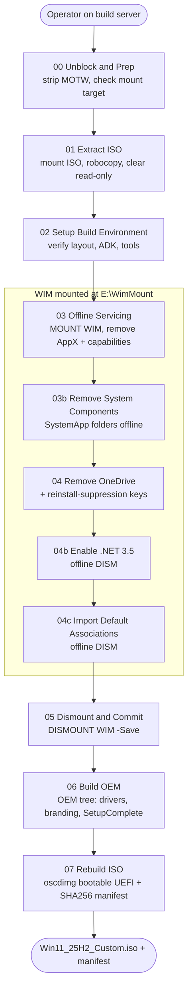
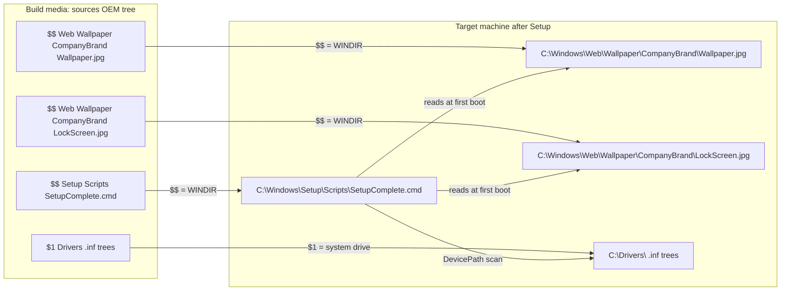
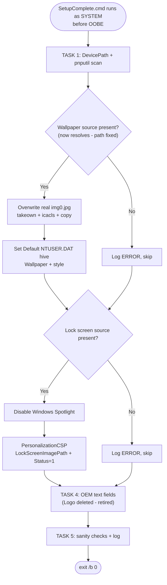

## v2.4 - Closing notes for the v2.x image line

> **Naming note:** this entry predates the script rename to the `01-` → `11-` sequential,
> verb-first convention used elsewhere in this repo (e.g. `06-BuildOEM.ps1` below is now
> `10-Build-OemLayer.ps1`). Kept as-is for historical accuracy — it documents the actual
> investigation as it happened. See `Scripts/README.md` for the current names.

This release closes the v2.x line: not a feature expansion, but a documented, root-caused fix for
a branding bug plus retirement of a dead code path. Keeping this as a worked example because the
root-cause analysis below is the kind of thing that's genuinely useful to read before you hit the
same class of bug yourself (a producer/consumer path mismatch between two scripts that never
talked to each other).

---

## 1. What v2.4 is

Closing release of the current image line. Not a feature expansion. Three things:

1. Fixes the branding failure (lock screen + wallpaper not applying) at the **real** root cause, confirmed from the deployed-build logs.
2. Retires the OEM logo (it never rendered on Win11).
3. Consolidates the validated v2.3 work into one documented baseline.

Deferred to v3.0: orchestrator script, audit-mode baseline automation, PDF/Adobe association decision.

---

## 2. Branding failure - root cause (corrected, evidence-based)

### Symptom
Drivers and OEM text apply correctly. Desktop wallpaper and lock screen do **not** load.

### Root cause - a path mismatch inside the build contract
Two files disagreed on where branding lives. Confirmed from `06-BuildOEM-APPLY-20260529-155901.log`:

| File | Path it uses | Evidence |
|---|---|---|
| `10-Build-OemLayer.ps1` (producer) | stages JPGs to `C:\Windows\Web\Wallpaper\CompanyBrand\` | log: `Copied Wallpaper: ... -> ...\$OEM$\$$\Web\Wallpaper\CompanyBrand\Wallpaper.jpg` |
| `SetupComplete.cmd` (consumer) | reads JPGs from `C:\Windows\Web\ORG\` (`BRANDROOT`) | `set "BRANDROOT=%SystemRoot%\Web\ORG"` |

At runtime both `WALLSRC` and `LOCKSRC` resolve to a folder that does not exist. TASK 2 and TASK 3 each hit their `if not exist` guard, log ERROR, and skip. Result: **both** wallpaper and lock screen blank, while everything that does not read that path (drivers, OEM text) works. That matches the observed symptom exactly.

### Second, compounding bug
In the deployed `SetupComplete.cmd`, `DEFWALL` had been set to `%BRANDROOT%\Wallpaper.jpg` - identical to `WALLSRC`. The img0 overwrite (`copy /y "%WALLSRC%" "%DEFWALL%"`) therefore copied the file onto itself. `img0.jpg` was never replaced even when the source existed.

### Earlier theories that were WRONG
Windows Spotlight and the `HKU\.DEFAULT` target were proposed as causes before the logs were available. The logs disprove both: the script never got past the file-existence check, so neither the lock screen logic nor the wallpaper logic ever executed. (Spotlight-disable and the Default-hive write are still kept as correct hardening - they just were not the cause.)

### Fix (minimal, change the consumer not the producer)
06 is validated and the JPGs land correctly. So only `SetupComplete.cmd` is corrected:

```
set "BRANDROOT=%SystemRoot%\Web\Wallpaper\CompanyBrand"        (was %SystemRoot%\Web\ORG)
set "DEFWALL=%SystemRoot%\Web\Wallpaper\Windows\img0.jpg"   (was %BRANDROOT%\Wallpaper.jpg)
```

`BRANDROOT` now matches what 06 produces; `DEFWALL` now points at the real OS default so the img0 overwrite is meaningful. The contract comment block was updated to the real path. One file changed for the branding fix.

### Design decision (flip if you disagree)
- Wallpaper = changeable default (img0 overwrite + Default hive).
- Lock screen = enforced (Spotlight disabled, then PersonalizationCSP).

---

## 3. OEM logo - retired

Confirmed by observation: logo configured, not shown in Settings > About. The OEM logo bitmap was a legacy System Control Panel feature; Win11's modern Settings surfaces the OEM text fields but not the logo bitmap. Retired:

- `10-Build-OemLayer.ps1` Step 4 no longer stages `OEMLogo.bmp` (and drops it from the verification list).
- `SetupComplete.cmd` TASK 4 already deletes any stale `Logo` value and writes text fields only.
- Constraint **C8 (OEMLogo 24-bit BMP) is retired**; the `OEM-Template\` README should drop the OEMLogo requirement.

The `OEMLogo.bmp` asset is left in `OEM-Template\` (harmless, unused) rather than deleted.

---

## 4. Changelog v2.3 -> v2.4

| Area | v2.3 | v2.4 |
|---|---|---|
| Branding path | consumer (`Web\ORG`) != producer (`Web\Wallpaper\CompanyBrand`) - silent skip | aligned to `Web\Wallpaper\CompanyBrand`; both files agree |
| img0 overwrite | DEFWALL == WALLSRC (self-copy no-op) | DEFWALL = real `img0.jpg` |
| OEM logo | staged + Logo value set, never rendered | retired in 06 and SetupComplete; C8 retired |
| 06 mount check | scoped to `E:\WimMount` (already correct in this build) | unchanged |
| Docs | no diagrams | 3 Mermaid diagrams added |

---

## 5. Canonical script line (verified against the uploaded ZIP)

| Order | Script | Modifies state |
|---|---|---|
| 00 | `01-Unblock-Scripts.ps1` | No |
| 01 | `02-Extract-Iso.ps1` | Yes |
| 02 | `03-Initialize-BuildEnvironment.ps1` | No |
| 03 | `04-Remove-ProvisionedApps.ps1` | Yes |
| 03a | `Diagnostics\Diagnose-AppxAndCapabilities.ps1` | No |
| 03b | `05-Remove-SystemApps.ps1` | Yes |
| 04 | `06-Remove-OneDrive.ps1` | Yes |
| 04b | `07-Enable-DotNet35.ps1` | Yes |
| 04c | `08-Import-DefaultAppAssociations.ps1` | Yes |
| 05 | `09-Dismount-Image.ps1` | Yes |
| 06 | `10-Build-OemLayer.ps1` | Yes |
| 07 | `11-Build-Iso.ps1` | Yes |

Helper/diagnostic files in `Scripts\`: `Diagnostics\Diagnose-Removal.ps1`, `06-BuildOEM-CMTrace-Snippet.ps1`, `07-RebuildISO-Autounattend-Snippet.ps1`. Naming is consistent; no renumbering required for v2.4.

---

## 6. Open items carried to v3.0

| Item | Disposition |
|---|---|
| Orchestrator script (single-run 00-07) | v3.0 |
| `AuditMode\Apply-SecurityBaseline.ps1` validation on reference VM | v3.0 |
| PDF / Adobe Reader default association | DECISION PENDING - your call; conflicting artifacts exist |
| `unattend\` build (Windows SIM) | operational prerequisite |
| SetupComplete support fields | now populated with your org's live values; verify before production |
| GPO P1: VBS/HVCI/CG disabled by GPP Registry in `Windows-11-Computers` | domain GPO remediation - gates production, not an image change |
| Corporate WLAN server cert validation disabled | domain GPO fix |

---

## 7. Architecture diagrams

### 7.1 Build pipeline and WIM mount lifecycle


*Diagram shows: the 00-07 pipeline, with offline-servicing scripts grouped inside the WIM mount lifecycle (mounted by 03, committed by 05).*

### 7.2 $OEM$ delivery mapping (corrected branding path)


*Diagram shows: producer (06) and consumer (SetupComplete) now agree on the CompanyBrand branding path - the fix that resolves the failure.*

### 7.3 SetupComplete.cmd branding flow (after fix)


*Diagram shows: with the path corrected, both source checks now pass, so wallpaper and lock screen logic actually executes.*

---

## 8. Validation step before sign-off

Re-run the cycle and confirm on a fresh deploy:

1. `06` apply log shows branding copied to `...\Web\Wallpaper\CompanyBrand\` (already confirmed).
2. After OOBE, check `%SystemRoot%\Temp\SetupComplete.log` shows `[TASK 2] img0.jpg overwritten OK` and `[TASK 3] Lock screen set OK` (not ERROR/skip).
3. New user profile shows your branded wallpaper; lock screen shows your branded lock screen image; Settings > About shows OEM text and no logo.

If TASK 2/3 still log ERROR, the JPGs are not at `C:\Windows\Web\Wallpaper\CompanyBrand\` on the target - check the ISO was rebuilt by 07 after 06 ran.
