<p align="center">
  <picture>
    <source media="(prefers-color-scheme: dark)" srcset="./assets/logo-horizontal-dark.svg">
    
  </picture>
</p>

<p align="center">
  
  
  
  
  
</p>

Modern Windows Image Factory is an enterprise-grade Windows image engineering framework that
treats operating system deployment as code.

The project enables organizations to build repeatable, secure, and deployment-ready Windows 11
images through automated offline servicing, security hardening, OEM customization, and image
lifecycle management.

Its goal is to bring Platform Engineering principles to Windows endpoint management by
transforming traditional image creation into a predictable, auditable, and version-controlled
process.

A self-contained PowerShell pipeline that produces a hardened, debloated Windows 11 Enterprise
ISO, ready for deployment via MDT/SCCM/Autopilot or straight USB install. Originally built for a
real enterprise fleet rollout, genericized here so anyone can adapt it to their own environment.

## This is offline image servicing, not a post-install debloat script

Most "debloat Windows" tools (Sophia Script, ChrisTitusTech's WinUtil, O&O ShutUp10, the various
`ThisWillMakeYourWindowsSuck`-style repos) run **after** Windows is already installed and booted -
they uninstall apps, flip registry keys, and disable services on a live, running OS.

This pipeline works **before** Windows ever boots. It mounts the install `.wim` offline with DISM,
strips provisioned AppX packages and SystemApps out of the image itself, then repackages a new
ISO. The machine's first boot is already the end state - nothing to run, nothing to wait for,
nothing for a user to interrupt.

| | Offline servicing (this repo) | Post-install debloat script |
|---|---|---|
| **When it runs** | Once, on the build server, before any machine exists | On every machine, after every install |
| **First-boot experience** | Already clean | Bloated until the script runs |
| **Scales to N machines** | Same effort for 1 or 10,000 (one image) | Effort scales with fleet size |
| **Can a user skip/interrupt it** | No - it's baked in | Yes - if it needs a reboot mid-run, network access, or admin consent |
| **Debugging a bad removal** | Fix the image, rebuild once | Fix the script, hope it's idempotent, re-run on every machine |
| **Best for** | Fleets deployed via MDT/SCCM/Autopilot from a common image | Individual machines, or environments where you can't control the install media |
| **Downside** | Higher setup cost (WIM servicing, ADK, a Sysprep reference VM) | Lower setup cost, but recurring runtime cost forever |

If you manage more than a handful of machines from a common image, doing the removal once at the
image level is strictly less total work than doing it per-machine forever. If you're debloating
your own single PC, a post-install script is faster to get running - use `tiny11builder` or
`nano11` for that instead, they're built for exactly that case.

## How it's structured

Two phases, one base image:

- **Build server** (`Scripts/01` -> `11`): offline WIM servicing + ISO repackage. No VM needed.
- **Reference VM** (`AuditMode/`): security baseline + optional software layer + Sysprep + capture.

See `ARCHITECTURE.md` for the full pipeline, `$OEM$` delivery mapping, and audit-mode
flow, with diagrams (also kept as standalone Mermaid files in `docs/diagrams/`).

Two variants from that one base:

| Variant | Contents |
|---|---|
| **THIN** | OS + drivers + branding + hardening. No apps. Apps layered at deployment (Intune/SCCM/etc). |
| **THICK** | THIN + M365 Apps and Adobe Acrobat baked in, as working examples of the two installer patterns (ODT and silent EXE/MSI). Add whatever else your org needs - see `AuditMode/Software/Install-ImageSoftware.ps1`. |

The consumer/inbox OneDrive and Teams clients are removed offline - those bundled clients cost
the original team repeated support tickets (personal-account prompts, stale tenant cache, double
icons). The enterprise OneDrive for Business and Teams (work) clients are different products and
ship in THICK builds via the M365 Apps ODT config - see `AuditMode/Software/ODT/ODT_SemiAnnual.xml`.

## Quick start

```powershell
# On your build server (needs the Win11 Enterprise ISO + Windows ADK installed)
Set-Location Scripts
.\01-Unblock-Scripts.ps1
.\03-Initialize-BuildEnvironment.ps1

# Per build - each script dry-runs by default, pass -Apply to actually change anything
.\02-Extract-Iso.ps1 -Apply
.\04-Remove-ProvisionedApps.ps1 -Apply
.\05-Remove-SystemApps.ps1 -Apply
.\06-Remove-OneDrive.ps1 -Apply
.\07-Enable-DotNet35.ps1 -Apply
.\08-Import-DefaultAppAssociations.ps1 -Apply
.\09-Dismount-Image.ps1 -Apply

# Optional (v2.6) - drivers/language packs/FOD/Store, run before 10 if you need them:
# .\12-Inject-Drivers.ps1 -Apply
# .\13-Add-LanguagePacks.ps1 -LanguageTag <tag> -Apply
# .\14-Add-FeaturesOnDemand.ps1 -FodSourcePath <path> -Apply
# .\15-Restore-MicrosoftStore.ps1 -Apply

.\10-Build-OemLayer.ps1 -Apply
.\11-Build-Iso.ps1 -Apply
```

Full run order, recovery commands, and why there are three separate offline-removal scripts:
see `Scripts/README.md`.

## Pipeline in action

Real runs against a Windows 11 25H2 build - not mock-ups. Every build-server script dry-runs by
default and only mutates state when you pass `-Apply`; most captures below show that pattern (the
dry-run first, then the `-Apply` run).

<details>
<summary><b>Show the build-server pipeline running</b></summary>

<br>

**Prepare** - unblock the downloaded scripts, then verify the build environment (folder structure,
required files, ADK/oscdimg discovery).

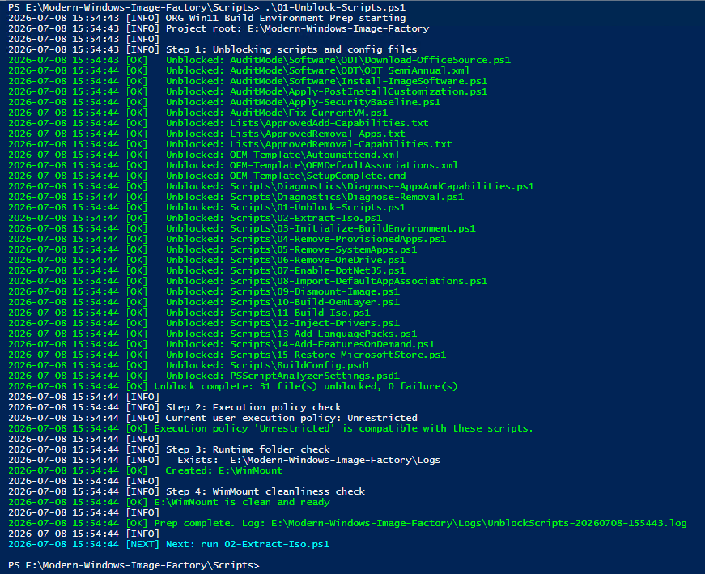

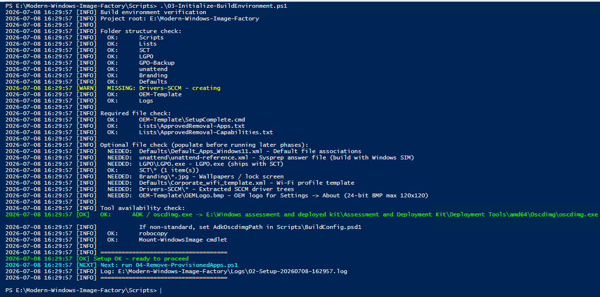

**Extract** - mount the Enterprise ISO, copy it out, and confirm the `install.wim` edition index
to service.

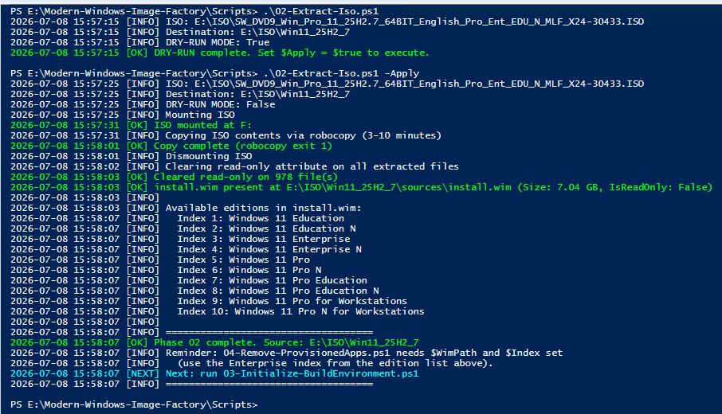

**Debloat, offline** - three separate removal passes against the mounted image: provisioned AppX,
then SystemApps, then the consumer OneDrive client plus its reinstall-suppression keys in the
offline hive.

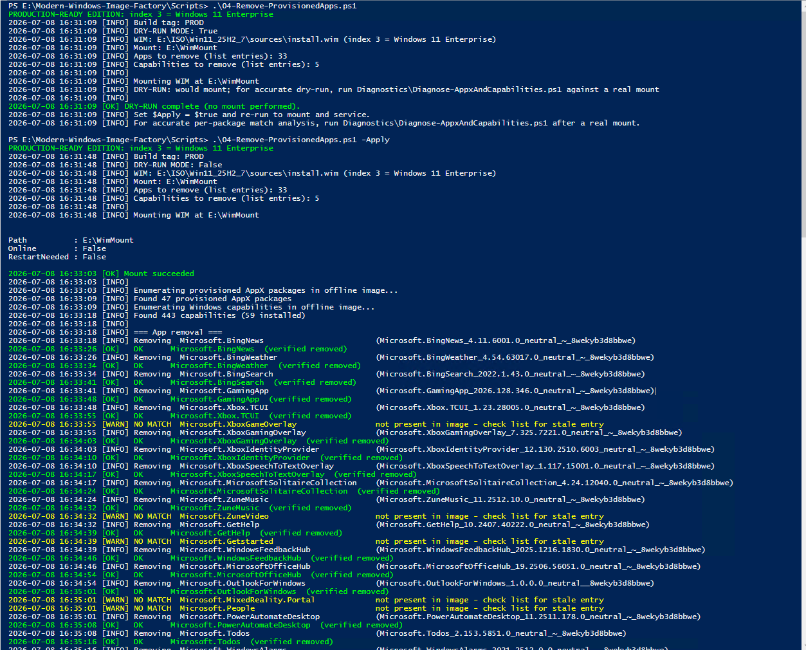

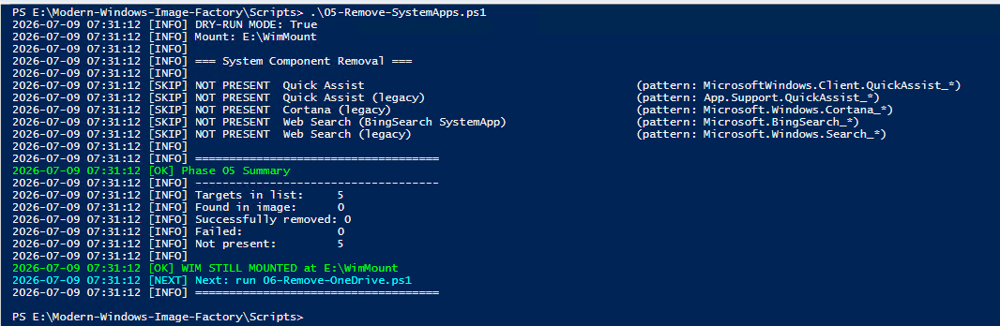

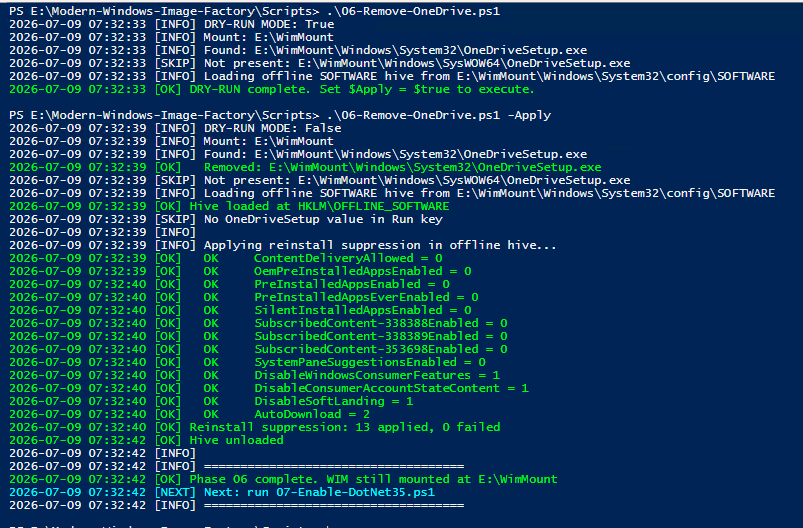

**Service** - enable .NET Framework 3.5 offline from the ISO's `sources\sxs`.

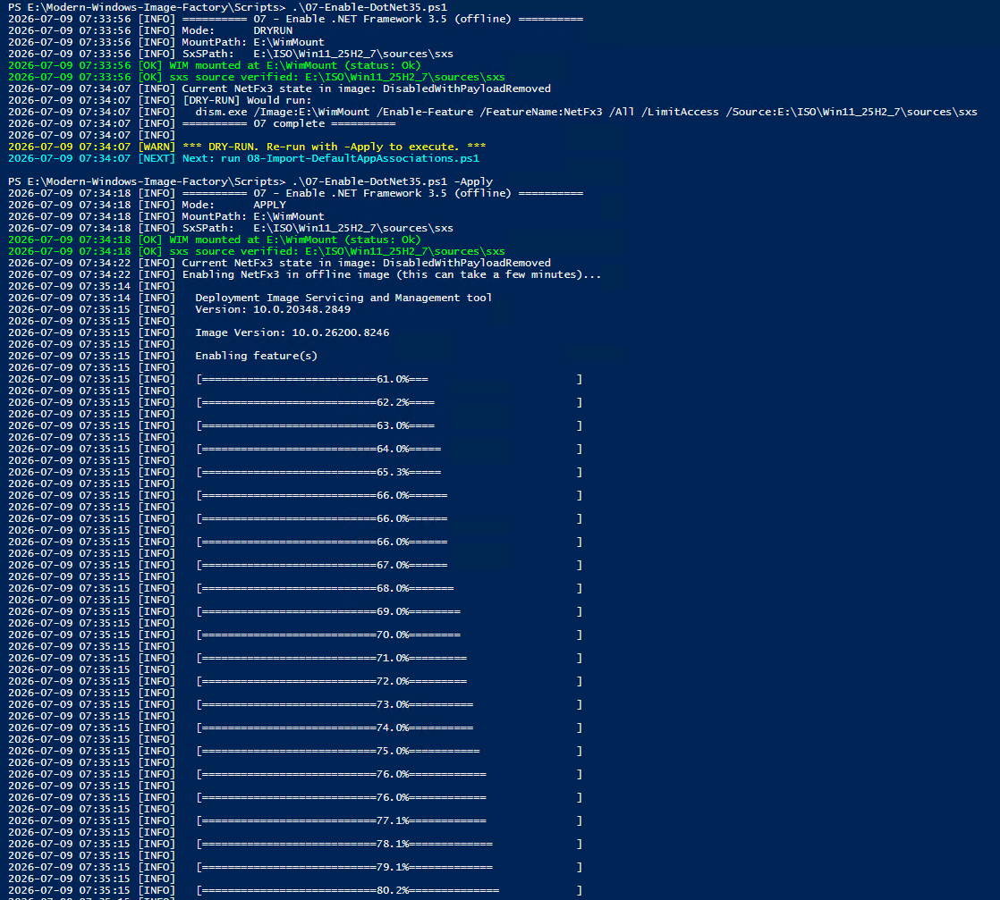

<!-- 08 (Import default app associations) is intentionally not linked here: its verify step
     prints the OEMDefaultAssociations.xml header (internal Reference/Owner fields). The PNG
     ships in docs/screenshots/pipeline/ - re-enable this line once that header is generic:
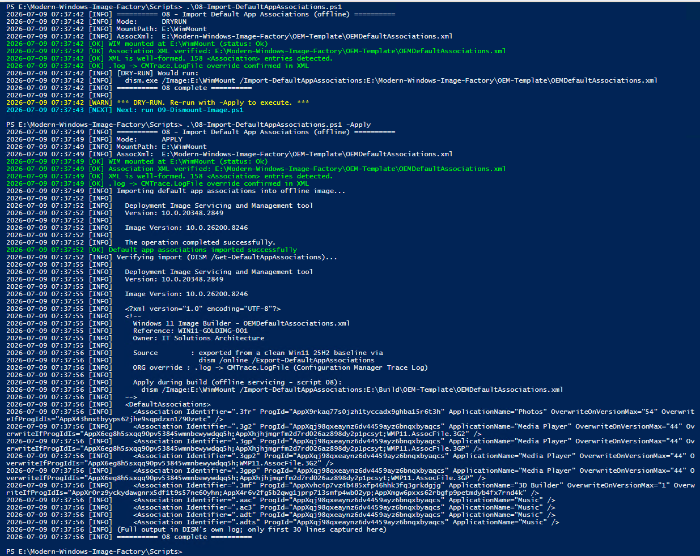
-->

**Commit &amp; package** - dismount with `-Save` to bake every change into the WIM, then repackage
a bootable ISO and emit a SHA256 manifest.

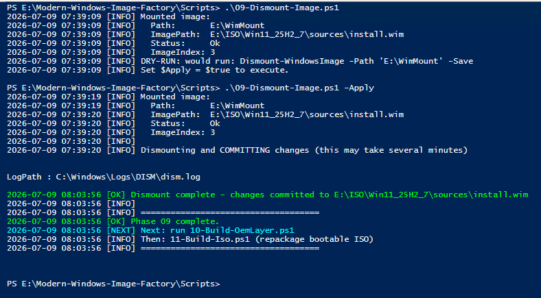

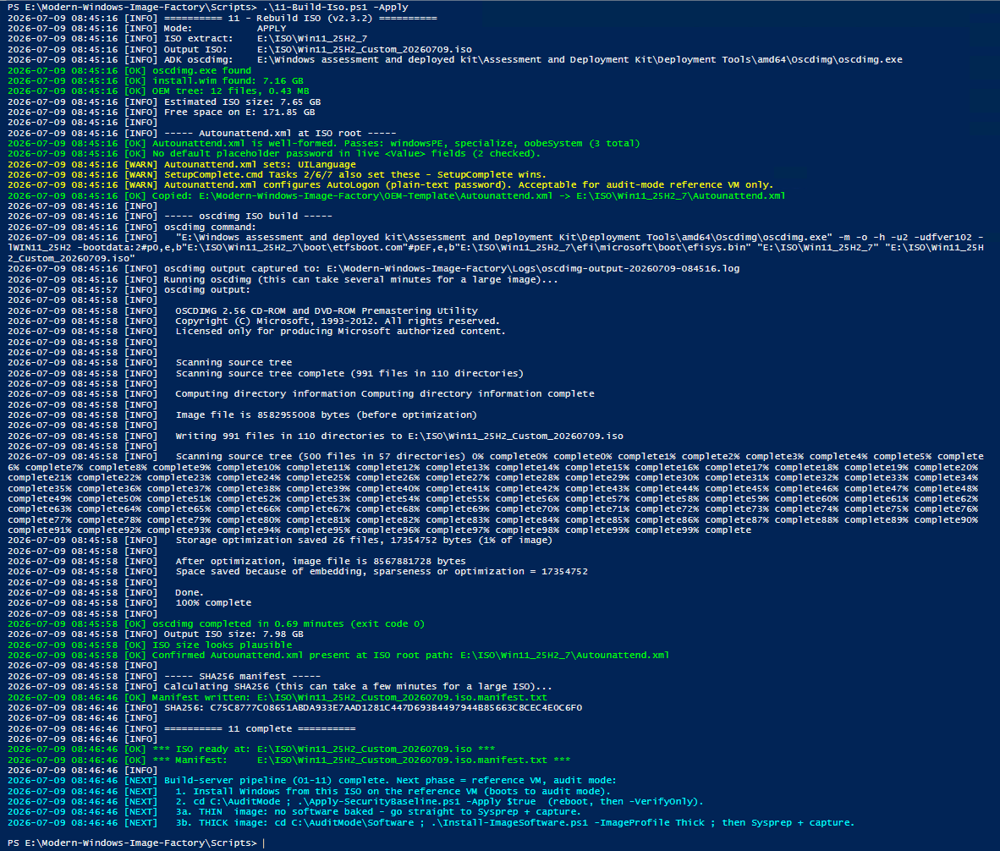

</details>

## Screenshots

_Placeholders below - swap in real captures from your own build. See
`docs/screenshots/README.md` for what each one should show and how to capture it._

| | |
|---|---|
| 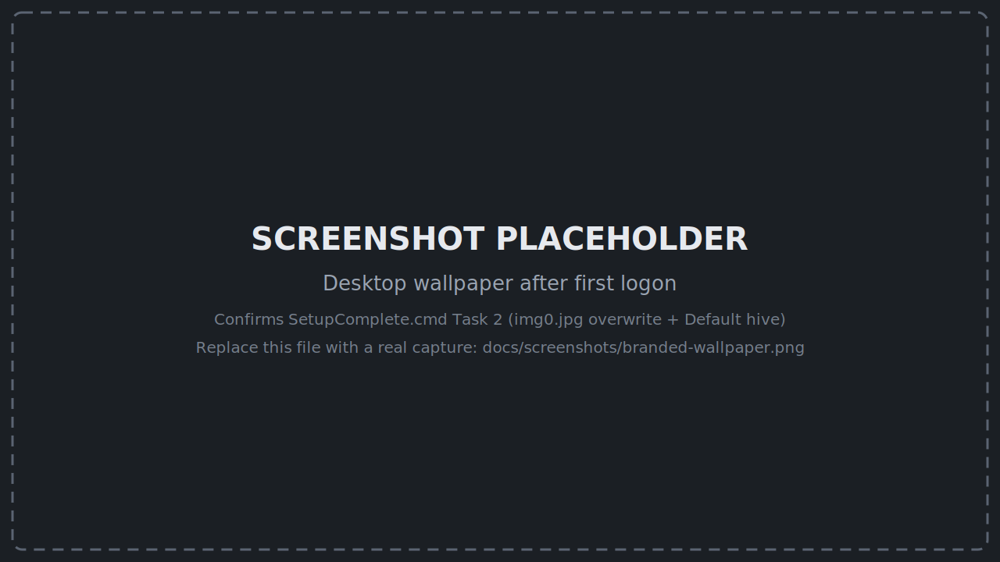<br>Desktop wallpaper after first logon | 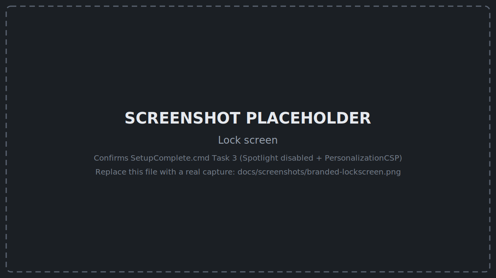<br>Lock screen |
| 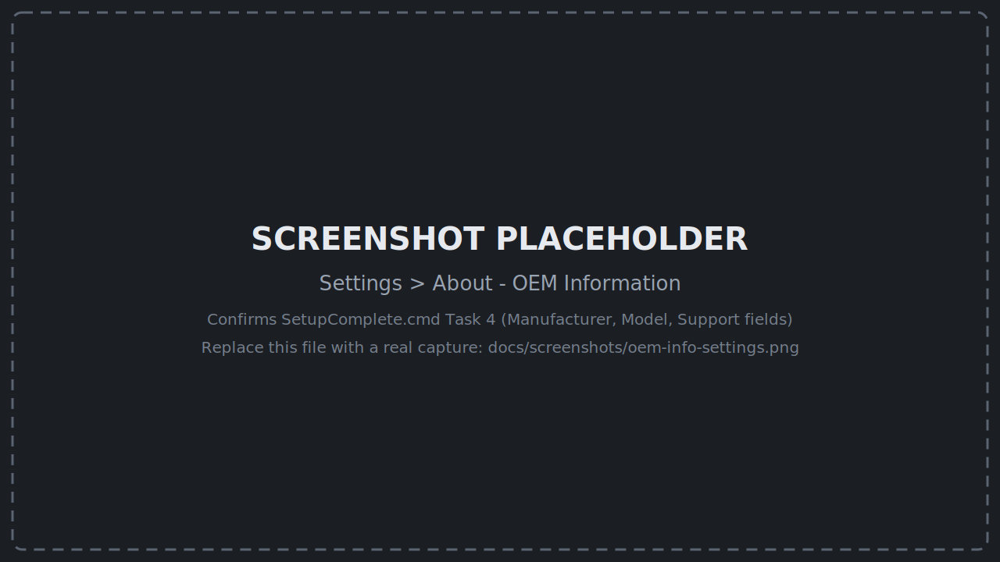<br>`Settings > About` OEM Information | 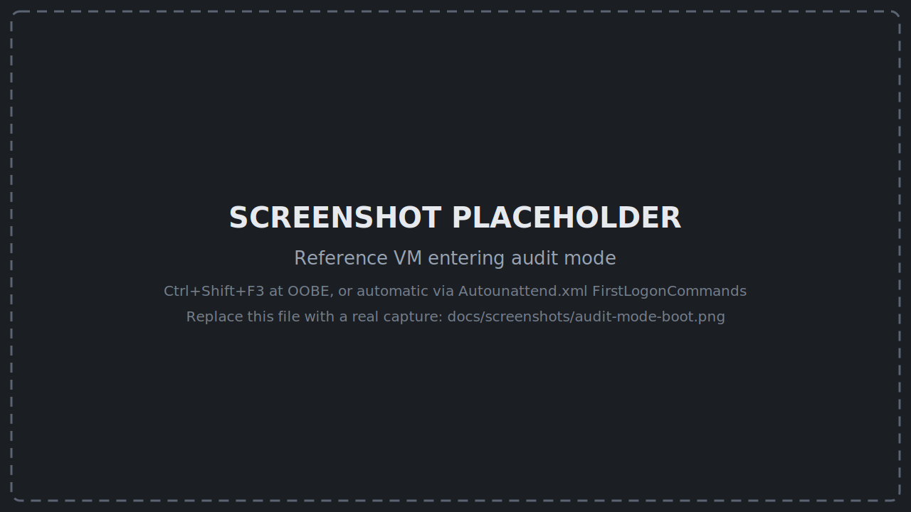<br>Reference VM entering audit mode |

## Before you use this for real

This repo ships with obvious placeholders instead of your organization's real values. Nothing
here will silently apply your identity to someone else's fleet - you have to go fill these in:

| What | Where | Placeholder |
|---|---|---|
| Company name / support desk | `OEM-Template/SetupComplete.cmd` | `ORG`, `<SERVICE_DESK_PHONE>`, `<SERVICE_DESK_HOURS>`, support URL |
| Wallpaper / lock screen images | `Branding/` | folder is empty - see `Branding/README.md` |
| Domain / GPO backup source | `GPO-Backup/README.md`, `Defaults/README.md`, `LGPO/README.md` | `corp.contoso.local` |
| Sysprep answer file admin password | `OEM-Template/Autounattend.xml` | `!ChangeMe2026!` (this is a **plaintext password in an unattend file** - audit-mode reference VM only, never on a domain-joined or internet-facing box) |
| Locale / timezone defaults | `AuditMode/Apply-PostInstallCustomization.ps1` | Set to `pt-AO` / `W. Central Africa Standard Time` (Angola) for this deployment - change `$LocaleName`/`$Timezone`/`$GeoId`/`$GeoName` if deploying elsewhere |
| M365 config ID / product list | `AuditMode/Software/ODT/ODT_SemiAnnual.xml` | `ORG-M365-SemiAnnual` |
| THICK software beyond M365/Adobe | `AuditMode/Software/Install-ImageSoftware.ps1` | commented `$AppDefinitions` template entry |
| ISO path, mount point, WIM index, ADK location | `Scripts/BuildConfig.psd1` | `E:\ISO\...`, `E:\WimMount`, index `3` - every script in `Scripts/01`-`11` reads these as defaults, overridable per-run via parameters (`-MountPath`, `-WimPath`, etc.) |

Grep for `ORG`, `CompanyBrand`, `yourcompany`, and `contoso.local` across the repo if you want to
find every spot in one pass - those four tokens cover essentially all of it.

## Folder structure

```
.
├── AuditMode/            # Reference-VM scripts: security baseline, software layer, Sysprep prep
├── Branding/             # Wallpaper/lock screen assets (empty - bring your own)
├── Defaults/             # Default app associations / WiFi profile sourced from your domain (not yet wired into any script - see ARCHITECTURE.md)
├── Drivers-SCCM/         # Not shipped - create and populate with your driver trees before running script 10
├── GPO-Backup/           # Where you drop `Backup-GPO` output before extracting to LGPO text
├── LanguagePacks/        # Not shipped - optional, per-language-tag CABs for script 13 (v2.6)
├── LGPO/                 # Local Group Policy text files applied on the reference VM
├── Lists/                # Approved-removal (and, since v2.6, approved-addition) lists
├── OEM-Template/         # $OEM$ tree: Autounattend.xml, SetupComplete.cmd, OEM info
├── SCT/                  # Drop the Microsoft Security Compliance Toolkit baseline here
├── Scripts/              # 01-11 build-server pipeline + 12-15 optional (v2.6) + Diagnostics/
├── Software/             # Not shipped - optional, e.g. MicrosoftStore/ for script 15 (v2.6)
└── unattend/             # Sysprep + MDT answer files (build with Windows SIM)
```

Every folder has its own `README.md` explaining what goes there and why.

## What this doesn't do

- Doesn't touch Autopilot enrollment or Intune policy - this produces the base image, deployment
  tooling is a separate concern.
- Doesn't include an orchestrator script that runs 01->11 in one command by design - each phase
  should be reviewable/interruptible on a build server, and you'll want to inspect logs between
  phases the first several times you run this.
- Doesn't manage driver packs - `10-Build-OemLayer.ps1` stages whatever's in your
  `Drivers-SCCM\` folder, sourcing/organizing those per hardware model is on you.
  (`Scripts/12-Inject-Drivers.ps1`, v2.6, is a separate optional offline-injection path for
  boot-critical drivers - see `Scripts/README.md`.)
- Doesn't yet wire up `Defaults/` (default-app associations, Wi-Fi profile) - checked for
  presence by script `03` but not applied by any script. Tracked as a real gap, not a
  documentation typo - see `ARCHITECTURE.md` §6 (Known gaps).

## Background / worked example

`CHANGELOG.md` documents a real branding bug this pipeline hit and how it was root-caused (a
path mismatch between the script that stages branding files and the script that consumes them at
first boot) - worth reading before you customize `10-Build-OemLayer.ps1` or `SetupComplete.cmd`,
since it's exactly the class of bug you'll hit if the two ever disagree on a path again.

## License

MIT - see `LICENSE`. Use it, fork it, sell services around it, whatever. No warranty; this
touches DISM/WIM servicing and Sysprep, test on a VM before you point it at real hardware.

## Contributing

See `CONTRIBUTING.md`. Roadmap and version targets: `ROADMAP.md`.
